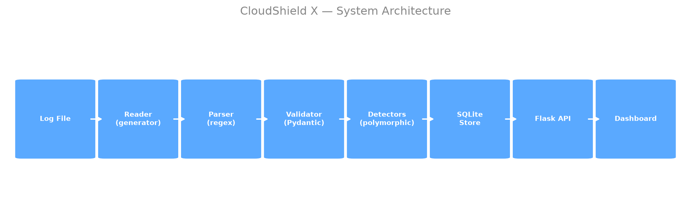
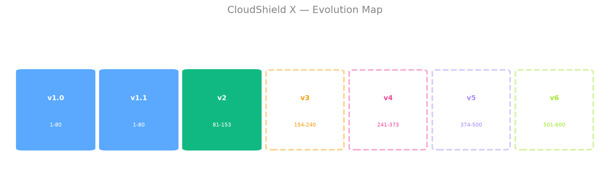

# 🛡️ CloudShield X — v2: The Threat Intelligence Engine

> Enterprise-grade CSPM platform built from scratch in Python.
> v1.0 shipped in 3 days. v1.1 closed the audit: 80/80 steps built.
> v2 turned it into an engine — SQL joins, recursive CTEs, a
> hand-written graph engine, and a 0/1 knapsack response planner.
> 73/73 DSA + SQL steps, 46 tests, 8 real decision records.


## 🚀 Live Demo
**[Try it live →](https://cloudshield-x-v1-4rdy68whxptnf6whzzrdrd.streamlit.app)**

## 🗺️ Architecture & Growth




## 📖 The Honest Story

v1.0 shipped in 3 days — 5 features, 5 tests, deployed.
But its range was 80 roadmap steps and it used 25.

I audited my own work, found that, and closed it in v1.1.
The audit found 3 real bugs:

| # | Bug | Fix |
|---|-----|-----|
| 1 | `split()` broke on quoted fields | Compiled regex with named groups |
| 2 | Memory-only — restart lost everything | SQLite persistence |
| 3 | `print()` instead of logging | Structured JSON logging + run_id |

v1.1 was a flat table with everything crammed into one place.
v2 asked a harder question: what happens when an attacker doesn't
stay put? That single question is why v2 exists — a normalised
3-table schema, SQL that answers questions instead of Python
looping over rows, and a graph engine written by hand to trace
how far an intruder could actually spread. Three real deployment
bugs turned up along the way, and one SQL finding surprised me
enough to write it down twice (see Results, below).

## ✨ Features

**Foundation (v1.0):**
- Log File Reader — File I/O, error handling
- Suspicious IP Detector — threshold-based counting
- Alert System — testable, typed alerts
- CSV Report Generator — Pandas DataFrame
- Streamlit Dashboard — upload, scan, download

**Completion (v1.1):**
- Pydantic validation — bad data rejected at parse boundary
- Regex parser — handles real Apache/nginx logs
- SQLite database — history survives restart
- OOP detector hierarchy — polymorphic, extensible
- NumPy/Pandas analytics — p95 data-driven threshold
- Plotly + Seaborn charts — interactive dashboard
- Threat intel feeds — external reputation API
- Flask alert API — `GET /alerts`, `GET /health`
- Pre-commit hooks — black, flake8, mypy, bandit clean
- LLM summaries — verified, never fabricated

**Threat Intelligence Engine (v2):**
- **F1 Threat Store** — 3-table schema, foreign keys, indexed
- **F2 Threat Reports** — SQL grouping, window and date functions
- **F3 Feed Reconciliation** — joins, subqueries, emulated FULL OUTER JOIN
- **F4 Attack Pattern Analytics** — LAG escalation detection, moving average
- **F5 Propagation Trace** — recursive CTE, "how far could they spread?"
- **F6 IOC Store** — hand-built hash table, sets, domain trie
- **F7 Ranking Engine** — 6 sorts, size-k min-heap, BST/AVL comparison
- **F8 Scanner Pipeline** — linked-list stages, LRU cache, FIFO alert queue
- **F9 Attack Graph Engine** — BFS, DFS, Dijkstra, Union-Find, topo sort
- **F10 Burst & DDoS Detector** — sliding window, segment tree
- **F11 Response Planner** — 0/1 knapsack DP, with a real greedy counter-example
- **F12 Signature Matcher** — KMP string search, bitwise subnet checks
- **F13 Consolidation** — full structure-to-security-problem map
- **REST API** — 8 new endpoints, documented with Swagger at `/apidocs`
- **Dashboard** — 4 pages, every number read from the database or logs, none typed in

## 📊 Results (measured, not guessed)

**v1 → v1.1:**
- Parser: split() vs regex — disagreed on real log lines
- Tests: 5 (v1.0) → 11 (v1.1)
- Steps: 25 (v1.0) → 80/80 (v1.1)
- Security: 0 bandit findings

**v2 — thirteen measurements, all run against real code:**

| Measurement | Result |
|---|---|
| 50,000 event inserts | 0.199 s |
| Single-IP profile query — indexed vs not | 0.098 ms vs 2.925 ms (**~30x faster**, SCAN → SEARCH USING INDEX) |
| Top-attackers aggregate report — indexed vs not | 31.8 ms vs 13.6 ms — **index didn't help**, see note below |
| Linear vs binary IP search (20k) | 0.42 ms vs 0.01 ms (**~40x faster**) |
| Bubble / Selection / Insertion sort (5k) | 1356 / 598 / 602 ms |
| Merge / Quick sort (5k) | 11.9 ms / 8.3 ms |
| Heap top-10 vs full `sorted()[:10]` (50k) | 3.6 ms vs 10.1 ms (**2.8x faster**) |
| BST height, sequential insert 1..1000 | 1000 (degenerated to a linked list) |
| AVL height, same input | 10 |
| Own hash table vs list scan (10k) | 0.013 ms vs 0.150 ms (**~12x faster**) |
| Naive search vs KMP (worst-case input) | 41.5 ms vs 71.0 ms — **naive won** |
| Naive burst scan vs sliding window (100k) | 514.3 ms vs 34.9 ms (**~15x faster**) |
| Python BFS vs recursive CTE (500 hosts) | 2.27 ms vs 2.51 ms — close, BFS edged it |
| LRU cache hit rate (80/20 access pattern) | 79.9 % |
| Array append vs `insert(0,x)` (100k) | 10.2 ms vs 1285 ms (**126x slower**) |
| DP vs greedy (locked counter-example) | DP = 7, Greedy = 5 — DP wins |

Two findings worth reading twice: the `(source_ip, event_time)` index made the
single-IP lookup 30x faster, but made the top-attackers *aggregate* report
slower — because that query filters on `status`, not `source_ip`, so the
index changes the scan order without giving it anything to seek on. Same
index, opposite outcome, depending entirely on what the query actually asks.
And KMP lost to naive string search in pure Python, on two separate runs —
a textbook complexity win that measured reality didn't agree with.

## 🔌 API Reference

Full interactive docs at `/apidocs` (Swagger/OpenAPI) once the API is running.

```bash
# Run a scan
curl -X POST http://localhost:5000/scan \
  -H "Content-Type: application/json" \
  -d '{"log_path": "data/sample_server.log", "threshold": 5}'

# Top attackers
curl "http://localhost:5000/threats?limit=10&severity=HIGH"

# Full profile for one IP (joins F1+F3)
curl http://localhost:5000/threats/203.0.113.7

# 7-day moving average trend (F4)
curl http://localhost:5000/trend

# Propagation trace from a host (F5, recursive CTE)
curl "http://localhost:5000/propagation?host=host-A"

# Attack paths between two hosts (F9, DFS)
curl "http://localhost:5000/graph/paths?source=host-A&target=host-D"

# Cheapest attack route (F9, Dijkstra)
curl "http://localhost:5000/graph/cheapest?source=host-A&target=host-D"

# Response plan under a budget (F11, 0/1 knapsack)
curl -X POST http://localhost:5000/plan \
  -H "Content-Type: application/json" \
  -d '{"budget": 10}'

# Health check
curl http://localhost:5000/health
```

Every route is thin — parse the request with Pydantic, call one engine
function, return JSON. Bad input returns a `400` with a readable message,
never a `500` from inside the engine.

## 🏗️ Tech Stack

Python 3.12 · Pydantic · NumPy · Pandas · Matplotlib · Seaborn ·
Plotly · SQLite · Flask · flasgger (Swagger) · Streamlit · pytest ·
black · flake8 · mypy · bandit · pre-commit

## 💻 How to Run

```bash
git clone https://github.com/dharunvishnu2006-ctrl/Cloudshield-X.git
cd Cloudshield-X
python -m venv venv
venv\Scripts\activate
pip install -r requirements.txt

# initialise the v2 database (safe to re-run)
python -c "from src.db import init_db; init_db()"

# terminal 1 — the API
flask --app api run

# terminal 2 — the dashboard
streamlit run app.py
```

## 🧪 Tests

```bash
python -m pytest tests/ -v
# 46 tests — all passing (11 from v1/v1.1, 35 from v2)
```

## 📚 Docs

- [System Design](docs/design.md) — problem, data model, trade-offs, known limits
- [Decision Records](docs/adr/) — 8 ADRs, each with the option rejected and why
- [DSA in Security Context](docs/dsa-in-security.md) — every structure mapped to the feature it powers

## 🎓 What I Learned

v2 is where the roadmap stopped being separate topics and started being one
engineering problem. A hash table isn't just Step 95-96 — it's the reason
a blocklist check doesn't cost more as the list grows. A recursive CTE isn't
just Step 148 — it's the only sane way to answer "how far could they have
spread" without a Python loop calling the database over and over. The
biggest lesson wasn't any single algorithm — it was that measuring beats
guessing, twice over: the index that helped one query and hurt another, and
KMP losing to the naive search it was supposed to beat. Both are now
permanent lines in this README instead of things I assumed and moved past.

## 🗺️ Roadmap

<!-- VERSIONS_TABLE_START -->
| Version | Status | Steps | Tests | Description |
|---------|--------|-------|-------|-------------|
| **v1.0** | ✅ Shipped | 1-80 | 5 | Foundation — 3-day sprint |
| **v1.1** | ✅ Shipped | 1-80 | 11 | Completion — all 80 steps built |
| **v2** | ✅ Shipped | 81-153 | 35 | Threat Intelligence Engine — DSA + SQL |
| **v3** | 🔜 Planned | 154-240 | — | Statistics Engine — Maths + ML start |
| **v4** | 🔜 Planned | 241-373 | — | ML, FastAPI, Docker |
| **v5** | 🔜 Planned | 374-500 | — | Deep Learning, GenAI Agents |
| **v6** | 🔜 Planned | 501-600 | — | MLOps, Kubernetes, Monitoring |
<!-- VERSIONS_TABLE_END -->

[View Architecture](docs/architecture.png) · [View Evolution Map](docs/evolution.png) · [Decision Records](docs/adr/)

## 👤 Author

**J. Dharun Vishnu**
[GitHub](https://github.com/dharunvishnu2006-ctrl)